<p align="center">
  
</p>

<h1 align="center">Bifröst</h1>

<p align="center"><em>The rainbow bridge between LLMs and Grafana.<br>Multi-transport · Multi-role · Multi-environment MCP server framework — with a Python SDK, a React chat UI, and first-class VSCode integration.</em></p>

<p align="center">
  <a href="LICENSE"></a>
  =3.11">
  
  
  
  
  
  
  
</p>

<p align="center">
  <a href="#-quick-start">Demo</a> ·
  <a href="docs/getting-started/installation.md">Docs</a> ·
  <a href="docs/api/mcp-tools-reference.md">Tool Reference</a> ·
  <a href="docs/packages/sdk.md">Python SDK</a> ·
  <a href="CHANGELOG.md">Changelog</a> ·
  <a href=".github/ISSUE_TEMPLATE/bug_report.md">Report Bug</a>
</p>

---

<p align="center">
  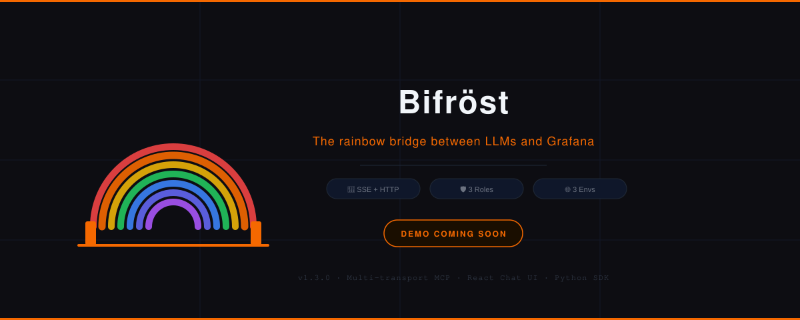
</p>

<p align="center">
  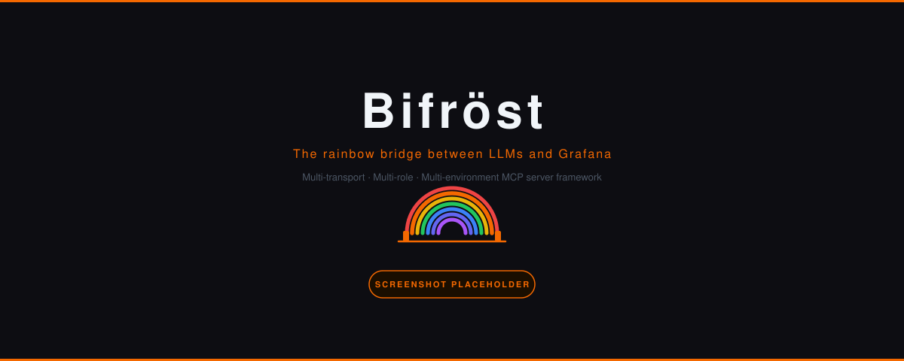
</p>

---

## 🤔 Why Bifröst?

LLMs are now smart enough to drive Grafana — *if* you give them a clean, typed, role-aware way to talk to it. Most teams end up with one of three ugly options: a thin Python wrapper that bypasses RBAC, a hand-rolled tool plugin glued into one specific agent, or a "let the LLM curl the API" hack that leaks admin tokens into prompt logs.

**Before Bifröst**, every team that wanted "AI-assisted Grafana" rebuilt the same five things — environment switching, role-scoped tokens, retry/rate-limit logic, MCP tool surfacing, and a chat UI. Each integration was bespoke, brittle, and shipped with hard-coded `prod-admin` tokens in someone's `.zshrc`.

**Bifröst is the maintained, opinionated alternative**: a production-grade [MCP](https://modelcontextprotocol.io) server that fronts the Grafana HTTP API with **three named environments** (`dev` / `perf` / `prod`), **three RBAC-scoped service-account tokens** per environment (`viewer` / `editor` / `admin`), and **two transports** (SSE for VSCode + browser, streamable HTTP for SDK + CI). On top of the server you get a polished React chat UI that wires Claude or GPT to the live MCP tools, and a Python SDK for notebooks, scripts, and CI pipelines.

Built for **SREs, Platform Engineers, and Grafana Admins** who want to give Claude or GPT real, typed, audited access to their Grafana — without handing over the admin token, without writing a fresh integration every quarter, and without losing sleep over which environment the bot is poking at.

---

## ✨ Key Features

| | |
|---|---|
| 🌈 **One Bridge, Two Transports** | **SSE** for VSCode + browser UI · **Streamable HTTP** for SDK + CI — same tool surface, same role enforcement, declared at startup |
| 🛡️ **Three Roles, Three Tokens** | Every environment holds **viewer / editor / admin** service-account tokens. Each tool call selects the right token — never mixed, never escalated by accident |
| 🌍 **Three Named Environments** | `dev` / `perf` / `prod` — independently configured base URL, TLS, timeouts, rate limits. Switch active env with one flag or one click |
| 🧠 **AI Chat Interface** | React UI wires **Claude** or **GPT** to the live MCP tools. Streaming responses, tool-call visualization, conversation history, model picker |
| 🐍 **First-Class Python SDK** | `pip install grafana-mcp-sdk` → drop into notebooks/scripts. Async + sync APIs, mid-session role switching, `.toml` config |
| 🔌 **VSCode-Native** | Ships with `.vscode/mcp.json`, tasks, launch configs, and extension recommendations. Connect via the MCP extension in 5 seconds |
| 🧪 **20+ Typed MCP Tools** | Dashboards, datasources, alerts, folders, users, queries, health — every tool is a Pydantic-typed async function with full schema |
| 🚦 **Built-in Rate Limiting & Retry** | Per-environment `asyncio.Semaphore` rate limits + tenacity exponential backoff on 429 / 5xx. No more "but it worked locally" |
| 📋 **Structured Logging** | `structlog` JSON in prod, pretty console in dev. Every request/response logged (with auth headers redacted) |
| 🔐 **Encrypted Browser Config** | UI persists env configs in `localStorage` encrypted with a user passphrase via Web Crypto API. Export/import as `.env` |
| 🔄 **Hot Role Switching** | `async with g.as_role("admin") as admin_g:` — escalate temporarily, drop back automatically |
| 🐳 **Docker & Compose Ready** | One command boots Bifröst + a demo Grafana with seeded dashboards. Multi-stage build, ARM64-friendly |
| 📡 **Health-Checked Connections** | Every environment ping-tested on startup; UI shows live connection status badges per env, per role |
| 🔍 **Resource Explorer** | Side-panel tree view of folders → dashboards → panels, datasources, alert rules — fed by live MCP tool calls |
| ⏰ **CLI for Everything** | `grafana-mcp serve`, `grafana-sdk run list_dashboards`, `grafana-sdk shell` — the whole framework is scriptable |
| 🎯 **12-Factor Config** | Pydantic Settings with nested env vars (`GRAFANA_MCP_ENVIRONMENTS__PROD__BASE_URL`). Works in containers, K8s, systemd, dev laptops |

---

## 🌈 Two Transports. One Tool Surface.

Bifröst speaks two MCP transport dialects from the same codebase, picked at startup with `--transport`:

<table>
  <tr>
    <th width="50%" align="center">🖥️ SSE</th>
    <th width="50%" align="center">⚡ Streamable HTTP</th>
  </tr>
  <tr>
    <td align="center"><strong>VSCode MCP extension</strong><br><strong>Browser chat UI</strong><br><sub>Long-lived connection · live streaming</sub></td>
    <td align="center"><strong>Python SDK</strong><br><strong>CI / cron / notebooks</strong><br><sub>One-shot calls · pipeline-friendly</sub></td>
  </tr>
  <tr>
    <td>Server-Sent Events over HTTP. The MCP client opens one connection and consumes a stream of events; tool calls and responses multiplex over the same channel. Best fit for interactive sessions where the UI cares about progress.</td>
    <td>Streamable HTTP per spec — every tool call is a single POST that streams back. No long-lived connection, no proxies to configure, no SSE quirks. Best fit for SDK calls, batch jobs, and CI where you just want a typed result back.</td>
  </tr>
</table>

**Both transports** honor the same [role enforcement](docs/architecture/role-model.md), the same [environment selector](docs/architecture/environments.md), and expose the same [MCP tool surface](docs/api/mcp-tools-reference.md). Run them on different ports against the same backend if you want SDK *and* UI traffic at the same time.

---

## 🛡️ Three Roles. Zero Surprises.

Every environment in Bifröst holds **three service-account tokens**, mapped to Grafana's RBAC roles:

```
┌─────────────────── prod ───────────────────┐
│  base_url:  https://grafana.company.com    │
│  ─────────────────────────────────────────  │
│  viewer  →  glsa_xxx  (read-only)           │
│  editor  →  glsa_yyy  (silence alerts, etc) │
│  admin   →  glsa_zzz  (users, service accts)│
└─────────────────────────────────────────────┘
```

The MCP server picks the active token *per request* based on the declared role. Tools are tagged with a **minimum required role** — `silence_alert` needs `editor`, `list_users` needs `admin`, everything else falls back to `viewer`. Trying to call a privileged tool with a lower role raises a `PermissionError` *before* the HTTP call leaves the process. Roles never mix mid-call; tokens never escalate silently.

See [Role Model](docs/architecture/role-model.md) for the full hierarchy and the `TOOL_MINIMUM_ROLE` table.

---

## 🆚 Why not just give the LLM a curl wrapper?

| Feature | **Bifröst** | Curl-wrapper script | Bespoke per-agent plugin |
|---|:---:|:---:|:---:|
| RBAC-aware token selection | ✅ | ❌ | ⚠️ usually one token |
| Typed Pydantic tool I/O | ✅ | ❌ | ⚠️ mixed |
| Multi-environment support | ✅ | ❌ | ❌ |
| MCP-spec compliant (works with Claude / VSCode / Cursor / Cline) | ✅ | ❌ | ❌ |
| Retry + rate limiting | ✅ | ❌ | ❌ |
| Python SDK for notebooks | ✅ | N/A | ❌ |
| Auth headers scrubbed from logs | ✅ | ❌ | ⚠️ |
| One install, one config, every client | ✅ | ❌ | ❌ |
| Zero maintenance when Grafana API changes | ✅ | ❌ | ❌ |

Curl wrappers are easy to start, impossible to maintain, and leak admin tokens into shell history. Bespoke plugins die when the agent framework rev-bumps. Bifröst is the maintained alternative.

---

## 📸 Screenshots

<table>
  <tr>
    <td align="center">
      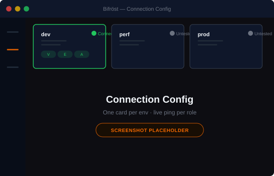
      <br><b>Connection Config</b>
      <br><sub>One card per env · live ping per role</sub>
    </td>
    <td align="center">
      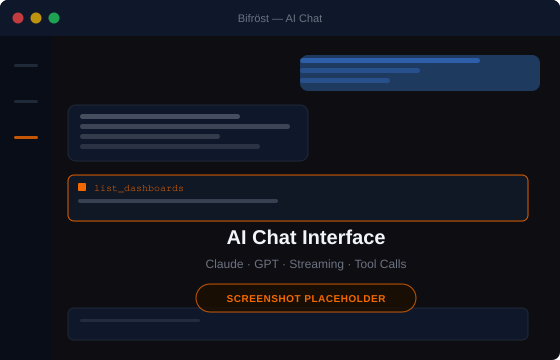
      <br><b>AI Chat</b>
      <br><sub>Claude / GPT wired to live MCP tools</sub>
    </td>
    <td align="center">
      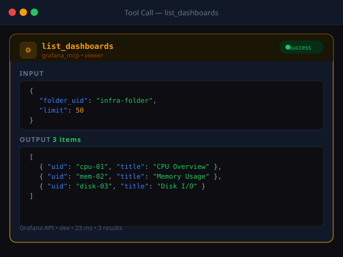
      <br><b>Tool Call Card</b>
      <br><sub>Collapsible tool name + params + result</sub>
    </td>
  </tr>
  <tr>
    <td align="center">
      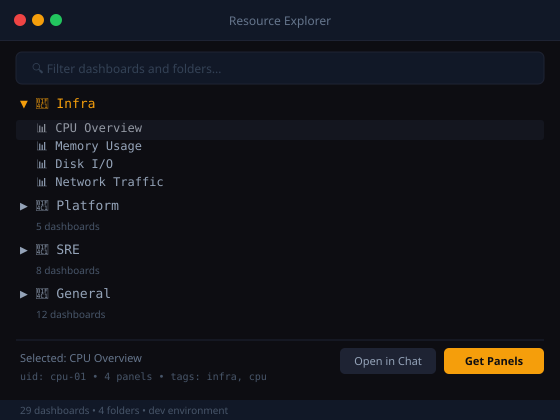
      <br><b>Resource Explorer</b>
      <br><sub>Folders → dashboards → panels (live)</sub>
    </td>
    <td align="center">
      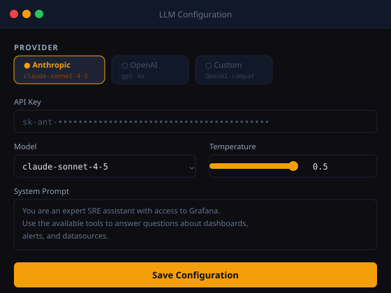
      <br><b>LLM Config Drawer</b>
      <br><sub>Provider · model · system prompt</sub>
    </td>
    <td align="center">
      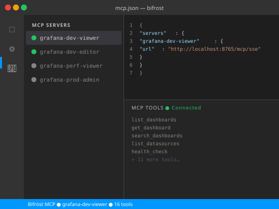
      <br><b>VSCode MCP Extension</b>
      <br><sub>Drops into Copilot Chat instantly</sub>
    </td>
  </tr>
  <tr>
    <td align="center">
      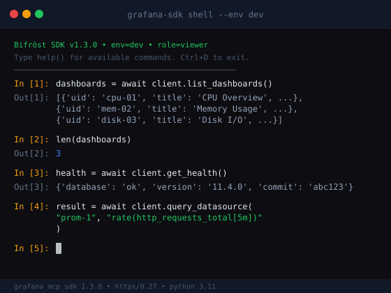
      <br><b>SDK Interactive Shell</b>
      <br><sub><code>grafana-sdk shell --env dev --role editor</code></sub>
    </td>
    <td align="center">
      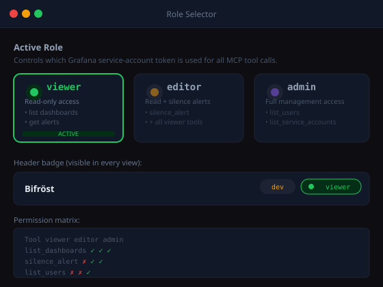
      <br><b>Role Selector</b>
      <br><sub>Viewer · Editor · Admin segmented control</sub>
    </td>
    <td align="center">
      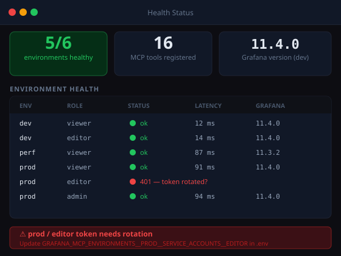
      <br><b>Health Status</b>
      <br><sub>Per-env, per-role connection badges</sub>
    </td>
  </tr>
</table>

---

## 🏛️ Architecture

```
┌────────────────────────────────────────────────────────────────────────┐
│                              Bifröst                                    │
└────────────────────────────────────────────────────────────────────────┘

  ┌────────────────┐    ┌────────────────┐    ┌────────────────┐
  │  React UI      │    │  Python SDK    │    │  VSCode MCP    │
  │  (browser)     │    │  (notebooks)   │    │  Extension     │
  └───────┬────────┘    └───────┬────────┘    └───────┬────────┘
          │  SSE                │  HTTP               │  SSE
          └─────────────────────┼─────────────────────┘
                                │
                                ▼
                  ┌─────────────────────────────┐
                  │   packages/core (Python)    │
                  │  ─────────────────────────  │
                  │   FastAPI + MCP SDK         │
                  │   Role Enforcement          │
                  │   Pydantic Tool Schemas     │
                  │   structlog · tenacity      │
                  └──────────────┬──────────────┘
                                 │
              ┌──────────────────┼──────────────────┐
              ▼                  ▼                  ▼
        ┌──────────┐       ┌──────────┐       ┌──────────┐
        │ env: dev │       │ env: perf│       │ env: prod│
        │  v/e/a   │       │  v/e/a   │       │  v/e/a   │
        └─────┬────┘       └─────┬────┘       └─────┬────┘
              │                  │                  │
              ▼                  ▼                  ▼
        ┌─────────────────────────────────────────────────┐
        │             Grafana HTTP API (9.x – 12.x)        │
        └─────────────────────────────────────────────────┘
```

The **core** package is a Python MCP server built on the official `mcp[cli]` SDK and FastAPI. It registers ~20 typed tools, enforces role minimums, selects the right service-account token per call, and pools `httpx` connections per environment+role pair. Three independent client surfaces — the **React UI**, the **Python SDK**, and the **VSCode MCP extension** — all talk the same MCP protocol over either SSE or streamable HTTP.

---

## 🚀 Quick Start

### Option A — Docker Demo *(recommended, 60 seconds)*

```bash
git clone https://github.com/gpadidala/bifrost.git
cd bifrost
./demo-run.sh
```

Then open **<http://localhost:5173>** for the chat UI, or point the VSCode MCP extension at `http://localhost:8765/mcp/sse`.

> 💡 **Tip:** The demo spins up a pre-seeded Grafana instance with sample dashboards, datasources, and alert rules — you don't need your own Grafana to try Bifröst. Three demo service-account tokens (viewer/editor/admin) are auto-injected so role switching works out of the box.

### Option B — Manual setup

<details>
<summary>Click to expand — 5 steps, ~4 minutes</summary>

**1. Clone and install the core package**

```bash
git clone https://github.com/gpadidala/bifrost.git
cd bifrost
uv sync                       # installs the workspace (core + sdk + ui)
```

**2. Configure your Grafana environments**

```bash
cp .env.example .env
# Edit .env with your Grafana URLs and three service-account tokens per env
```

See [Configuration Reference](docs/getting-started/configuration.md) for the full env-var schema.

**3. Start the MCP server (SSE for the UI)**

```bash
uv run grafana-mcp serve --transport sse --env dev --role viewer --port 8765
# → Bifröst MCP server listening on http://0.0.0.0:8765/mcp/sse
```

**4. Start the React UI** *(new terminal)*

```bash
cd packages/ui
pnpm install
pnpm dev
# → http://localhost:5173
```

**5. (Optional) Use the SDK from a notebook or script**

```bash
uv pip install -e packages/sdk
python -c "
from grafana_mcp_sdk import GrafanaMCP
with GrafanaMCP.from_env().sync() as g:
    print(g.list_dashboards(tags=['production']))
"
```

**Generating Grafana service-account tokens:**
`Administration → Service Accounts → Add service account` — create three accounts named `bifrost-viewer`, `bifrost-editor`, `bifrost-admin` with the matching Grafana role, generate a token for each, paste the `glsa_...` values into `.env`.

</details>

---

## 🧪 The MCP Tool Surface

| Group | Tools | Min role |
|---|---|---|
| 📊 **Dashboards** | `list_dashboards` · `get_dashboard` · `search_dashboards` · `get_dashboard_panels` | viewer |
| 🔌 **Datasources** | `list_datasources` · `get_datasource` · `query_datasource` | viewer |
| 🔔 **Alerts** | `list_alert_rules` · `get_alert_rule` · `list_alert_instances` | viewer |
| 🔕 **Alert mutations** | `silence_alert` | **editor** |
| 📁 **Folders** | `list_folders` | viewer |
| 👥 **Users & Org** | `list_users` · `list_service_accounts` | **admin** |
| 💚 **Utility** | `health_check` · `get_server_info` | viewer |

Every tool is a typed `async` function with a Pydantic input schema and a Pydantic output schema. Full reference: [docs/api/mcp-tools-reference.md](docs/api/mcp-tools-reference.md).

---

## ⚙️ Configuration

<details>
<summary><code>.env</code> — essential settings</summary>

```env
# ── Active selection ─────────────────────────────────────────
GRAFANA_MCP_ACTIVE_ENVIRONMENT=dev
GRAFANA_MCP_ACTIVE_ROLE=viewer

# ── Transport ────────────────────────────────────────────────
GRAFANA_MCP_TRANSPORT__MODE=sse
GRAFANA_MCP_TRANSPORT__HOST=0.0.0.0
GRAFANA_MCP_TRANSPORT__PORT=8765
GRAFANA_MCP_TRANSPORT__PATH_PREFIX=/mcp

# ── dev environment ──────────────────────────────────────────
GRAFANA_MCP_ENVIRONMENTS__DEV__BASE_URL=http://localhost:3000
GRAFANA_MCP_ENVIRONMENTS__DEV__TLS_VERIFY=false
GRAFANA_MCP_ENVIRONMENTS__DEV__SERVICE_ACCOUNTS__VIEWER=glsa_dev_viewer_xxx
GRAFANA_MCP_ENVIRONMENTS__DEV__SERVICE_ACCOUNTS__EDITOR=glsa_dev_editor_xxx
GRAFANA_MCP_ENVIRONMENTS__DEV__SERVICE_ACCOUNTS__ADMIN=glsa_dev_admin_xxx

# ── perf environment ─────────────────────────────────────────
GRAFANA_MCP_ENVIRONMENTS__PERF__BASE_URL=https://grafana-perf.company.com
GRAFANA_MCP_ENVIRONMENTS__PERF__SERVICE_ACCOUNTS__VIEWER=glsa_perf_viewer_xxx
GRAFANA_MCP_ENVIRONMENTS__PERF__SERVICE_ACCOUNTS__EDITOR=glsa_perf_editor_xxx
GRAFANA_MCP_ENVIRONMENTS__PERF__SERVICE_ACCOUNTS__ADMIN=glsa_perf_admin_xxx

# ── prod environment ─────────────────────────────────────────
GRAFANA_MCP_ENVIRONMENTS__PROD__BASE_URL=https://grafana.company.com
GRAFANA_MCP_ENVIRONMENTS__PROD__SERVICE_ACCOUNTS__VIEWER=glsa_prod_viewer_xxx
GRAFANA_MCP_ENVIRONMENTS__PROD__SERVICE_ACCOUNTS__EDITOR=glsa_prod_editor_xxx
GRAFANA_MCP_ENVIRONMENTS__PROD__SERVICE_ACCOUNTS__ADMIN=glsa_prod_admin_xxx

# ── Logging ──────────────────────────────────────────────────
GRAFANA_MCP_LOG_LEVEL=INFO
```

See the full [Configuration Reference](docs/getting-started/configuration.md) for every supported key, including TLS, timeouts, rate limits, and rotation hooks.

</details>

---

## 📡 CLI Overview

```bash
# Start the MCP server (SSE, dev env, viewer role)
grafana-mcp serve --transport sse --env dev --role viewer --port 8765

# Start the MCP server (streamable HTTP, prod env, admin role)
grafana-mcp serve --transport http --env prod --role admin --port 8766

# Validate config without booting
grafana-mcp validate-config

# List every registered tool with its min role
grafana-mcp list-tools

# Health-check every environment in your config
grafana-mcp health
```

And from the SDK:

```bash
grafana-sdk connect --env dev --role admin           # ping test
grafana-sdk run list_dashboards --env prod --tags production
grafana-sdk run get_dashboard --uid abc123 --env dev
grafana-sdk shell --env dev --role editor            # interactive REPL
grafana-sdk init                                      # write a starter .grafana-mcp.toml
```

Full reference: [docs/api/mcp-tools-reference.md](docs/api/mcp-tools-reference.md) · SDK reference: [docs/api/sdk-reference.md](docs/api/sdk-reference.md).

---

## 🚢 Deployment

<p align="center">
  <a href="docs/deployment/docker.md"></a>
  &nbsp;
  <a href="docs/deployment/vscode.md"></a>
  &nbsp;
  <a href="docs/deployment/ci-cd.md"></a>
</p>

- **Docker** — multi-stage `Dockerfile`, compose with optional demo Grafana, ARM64-friendly, corporate-proxy aware
- **VSCode** — `.vscode/mcp.json` + tasks + launch configs ship in the repo, drop-in for the MCP extension
- **CI/CD** — examples for GitHub Actions, GitLab CI, Jenkins; SDK calls fail the build on missing dashboards / firing alerts / unhealthy datasources

---

## 🗺️ Roadmap

- [x] **V1.0** — Core MCP server (SSE + HTTP), 20+ typed tools, role enforcement, three-env config
- [x] **V1.1** — Python SDK with sync + async APIs, `.grafana-mcp.toml` config, `grafana-sdk` CLI
- [x] **V1.2** — React chat UI with Anthropic + OpenAI, encrypted localStorage config, resource explorer
- [x] **V1.3** — VSCode integration (`mcp.json`, tasks, launch configs)
- [ ] **V1.4** — Loki + Tempo + Mimir tool groups (logs, traces, metrics queries)
- [ ] **V1.5** — Provisioning tools: dashboards-as-code, alert rules from YAML
- [ ] **V1.6** — OIDC/OAuth2 token rotation, Vault backend for service-account secrets
- [ ] **V1.7** — Streaming long-running queries (incremental panel results to chat)

Have a feature idea? [Open a feature request](.github/ISSUE_TEMPLATE/feature_request.md).

---

## 📚 Documentation

### Getting Started
- 📖 [Installation](docs/getting-started/installation.md)
- ⚡ [Quick Start](docs/getting-started/quick-start.md)
- ⚙️ [Configuration Reference](docs/getting-started/configuration.md)
- 🎬 [First Run Walkthrough](docs/getting-started/first-run.md)

### Architecture
- 🏛️ [System Overview](docs/architecture/overview.md)
- 🚇 [Transports — SSE vs HTTP](docs/architecture/transports.md)
- 🛡️ [Role Model & RBAC](docs/architecture/role-model.md)
- 🌍 [Environment Model](docs/architecture/environments.md)

### Packages
- 🐍 [`packages/core` — Python MCP server](docs/packages/core.md)
- ⚛️ [`packages/ui` — React chat UI](docs/packages/ui.md)
- 📦 [`packages/sdk` — Python developer SDK](docs/packages/sdk.md)

### Features
- 🧪 [MCP Tool Catalog](docs/features/mcp-tools.md)
- 🧠 [AI Chat Interface](docs/features/ai-chat.md)
- 🔌 [Connection Config Panel](docs/features/connection-config.md)
- 🌳 [Grafana Resource Explorer](docs/features/resource-explorer.md)

### API
- 📡 [MCP Tools Reference](docs/api/mcp-tools-reference.md)
- 🐍 [Python SDK Reference](docs/api/sdk-reference.md)

### Deployment
- 🐳 [Docker & Docker Compose](docs/deployment/docker.md)
- 🆚 [VSCode Integration](docs/deployment/vscode.md)
- 🔄 [CI/CD Integration](docs/deployment/ci-cd.md)

### Guides
- 🧰 [Troubleshooting](docs/guides/troubleshooting.md)
- 🤖 [LLM Setup — Claude & OpenAI](docs/guides/llm-setup.md)
- 🛠️ [agent-skills + ui-ux-pro-max integration](docs/guides/agent-skills.md)

---

## 🤝 Contributing

Pull requests are welcome. For major changes, please [open an issue](.github/ISSUE_TEMPLATE/feature_request.md) first to discuss the design.

**Quick workflow:**

1. **Found a bug?** — file a [bug report](.github/ISSUE_TEMPLATE/bug_report.md) with reproduction steps, your Grafana version, and the relevant `grafana-mcp` log lines (auth headers are auto-redacted)
2. **Want to add a new MCP tool?** — see the template in `packages/core/src/grafana_mcp/tools/` and the role-table convention in [docs/architecture/role-model.md](docs/architecture/role-model.md)
3. **Fixing something?** — fork, branch, `make test`, and open a PR against `main`

Local development, code style, commit conventions, and the test harness are documented in [CONTRIBUTING.md](CONTRIBUTING.md).

---

## 🧱 Tech Stack

<p align="center">
  
  
  
  
  
  
  
  
  
  
  
  
  
</p>

---

## 🙏 Acknowledgments

Built for the Grafana community — and for every SRE who's ever wanted to ask Claude "which dashboards depend on this datasource?" without writing a wrapper script. Special thanks to:

**[Anthropic](https://anthropic.com)** for the **Model Context Protocol** spec · **[FastAPI](https://fastapi.tiangolo.com)** · **[httpx](https://www.python-httpx.org)** · **[Pydantic](https://pydantic.dev)** · **[structlog](https://www.structlog.org)** · **[Tailwind CSS](https://tailwindcss.com)** · **[Radix UI](https://radix-ui.com)** · **[TanStack Query](https://tanstack.com/query)** · **[Zustand](https://zustand-demo.pmnd.rs)**

And to the [Grafana Labs](https://grafana.com) team for building the platform Bifröst exists to bridge.

> Bifröst is the sibling project to **[Heimdall](https://github.com/gpadidala/heimdall)** — Heimdall watches Grafana for things that break; Bifröst lets Claude and GPT *talk* to Grafana to fix them. Same family, same Norse roots.

---

## 📜 License & Author

**License:** [MIT](LICENSE) — free for commercial and personal use.

**Author:** **Gopal Rao** — Platform engineer building the AIOps toolkit.

<p align="center">
  <a href="https://github.com/gpadidala"></a>
  <a href="https://linkedin.com/in/gpadidala"></a>
  <a href="mailto:gopalpadiala@gmail.com"></a>
</p>

Copyright © 2026 Gopal Rao.

---

<p align="center">
  ⭐ <b>If Bifröst helps you ship AI-driven Grafana automation, please star the repo — it helps others discover it.</b>
</p>

<p align="center">
  Built with ❤️ by <a href="https://github.com/gpadidala">Gopal Rao</a>
</p>
